# Augusto de Moraes Piatto

## Introdução

Olá! Sou estudante no curso de Banco de Dados da FATEC, da turma de 2024 - 1º semestre.

Sempre gostei da área de exatas, e durante minha infância participei de campeonatos de xadrez e matemática. Ao longo dos anos de fundamental e ensino médio quis ingressar em uma área relacionada e, por conta disso, em 2010 iniciei um curso técnico na ETEC, em paralelo com o ensino médio, me graduando no final de 2011 em Manutenção Automotiva. Em 2013 ingressei em Engenharia de Materiais na UNESP de Guaratinguetá, iniciando pesquisas científicas em 2014. Em 2015 realizei intercâmbio pelo Ciência sem Fronteiras para o Estados Unidos, com duração de 9 meses de curso em Ciência dos Materiais e 2 meses realizando pesquisa científica.

Mudei de área para a programação web em 2020, através do bootcamp oferecido pela empresa Buser Brasil. Fiz 3 meses de curso, onde aprendi tecnologias como Vue (Javascript) e Django (Python), com o uso de Postgres no banco. Desde então tenho trabalhado com foco em front-end, aprendendo novas tecnologias e ferramentas.

  

 
 

## Meus Principais Conhecimentos
* Desenvolvimento Web Front-end: Experiência sólida utilizando Vue, com conhecimento em React.
* Desenvolvimento Web Back-end: Experiência sólida utilizando Django, além de uso esporádico de SpringBoot.
* Banco de Dados: Conhecimento em banco relacionais, principalmente postgres.

## Meus Projetos

### Em 2025-1
Durante o primeiro semestre de 2025, desenvolvi junto da minha equipe um projeto desafiador focado na criação de um sistema de pontos que registra as movimentações dos funcionários, com dashboards de gráficos e geração de relatórios. O sistema registra a entrada e saída dos funcionários, bem como a quantidade de horas trabalhadas, e gera gráficos e relatórios com essas informações.

**Empresa Parceira**: Projeto acadêmico desenvolvido no âmbito da FATEC, com parceria com a empresa Altave.

**Problema**: A necessidade de uma ferramenta que verificasse atrasos em funcionários de uma empresa terceira contratada, a fim de evitar atrasos e, por consequência, prejuízos para o cliente.

**Solução Entregue pela Equipe**: Desenvolvemos um sistema web que consome as informações de um banco de dados terceiro para exibir dados de entrada e saída dos funcionários. Esta interface possibilita diversos filtros para o usuários, além de oferecer gráficos e extração de relatórios para melhor análise e tomada de decisões.

[Repositório do projeto](https://github.com/SQLutions-FATEC/API-3-Semestre)

#### Tecnologias Utilizadas
* **PostgreSQL**: Banco de dados relacional utilizado para armazenar de forma estruturada os dados coletados pelo crawler, como notícias, autores e metadados. Foram implementadas tabelas normalizadas, índices para otimização de consultas e triggers para garantir a consistência dos dados.
* **Docker**: Empregado para containerização da aplicação, permitindo a criação de ambientes isolados para o crawler, API e banco de dados. Utilizou-se docker-compose para orquestrar múltiplos serviços (PostgreSQL + backend Java), garantindo portabilidade e implantação reproduzível em diferentes sistemas.
* **Java 21**: Linguagem principal do backend, com ênfase em orientação a objetos.
* **Spring Boot**: Framework para desenvolvimento da API RESTful, responsável por expor endpoints. Utilizou-se Spring Data JPA para mapeamento objeto-relacional (ORM) com o PostgreSQL.
* **Maven**: Gerenciador de dependências para automatização do build, integração de bibliotecas (Jsoup, Spring Boot) e configuração de perfis de desenvolvimento/produção.
* **Vue.js**: Framework web utilizado para construir o frontend da aplicação.

### Contribuições Pessoais

  
Desenvolvimento de Wireframe para as sprints

   
  Na imagem abaixo é exibida uma visão geral das telas criadas, que foi utilizado o software Figma para criá-lo e compartilhar entre o cliente e o resto do time.
   
  

    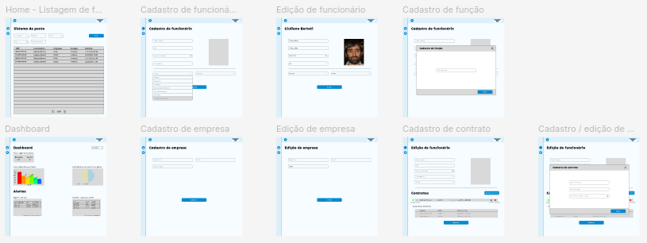
  

  A partir do design foram criadas as user-stories que podem ser vistas [aqui no github](https://github.com/SQLutions-FATEC/API-3-Semestre?tab=readme-ov-file#-backlogs--user-stories) do projeto, assim sendo durante todo o desenvolvimento do projeto foi-se utilizado as duas documentações apresentadas para guiar a compreensão do que seria desenvolvido nas sprints.

  
Modelagem inicial do banco de dados

   
  Juntamente com outros membros do grupo, montamos uma estrutura inicial das tabelas e relacionamentos do banco de dados. A ideia era fazer uma estrutura que nos servisse nos primeiros fluxos mapeados, sem grande visibilidade para o futuro, e montar um dump para esse banco que subia juntamente com o Docker, dessa forma não haveriam tantos conflitos quando precisássemos alterar algum relacionamento, tabela ou construir algo a mais.
   
  

    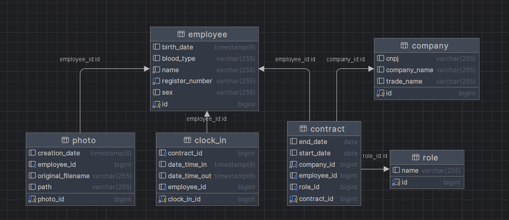
  

  
Desenvolvimento front-end utilizando Vue.js

   
  Durante o semestre, além do design do Figma, participei ativamente da criação das operações CRUD (Create, Read, Update, Delete), fundamentais para a gestão de dados do sistema. Um dos fluxos críticos sob minha responsabilidade foi a tela de gráficos e dashboards, funcionalidade estratégica que exibia todo o conjunto de informações que o banco de dados possuía.
  De modo geral, atuei em todas as telas do projeto, padronizando tanto código como visual e tentando otimizar o fluxo para o usuário final. Participei constantemente de conversas com PO para tirar ideias e melhorias com sugestões do cliente.
  Por atuar na área e ter um maior conhecimento, auxiliei os desenvolvedores que também atuavam no front-end e realizei CRs constantes.
  Foram pontos de atuação:
  
   
  

    
Definição de bibliotecas ao projeto

     
    Seleção estratégica de bibliotecas para garantir desempenho, escalabilidade e eficiência no desenvolvimento do projeto.
     
    

      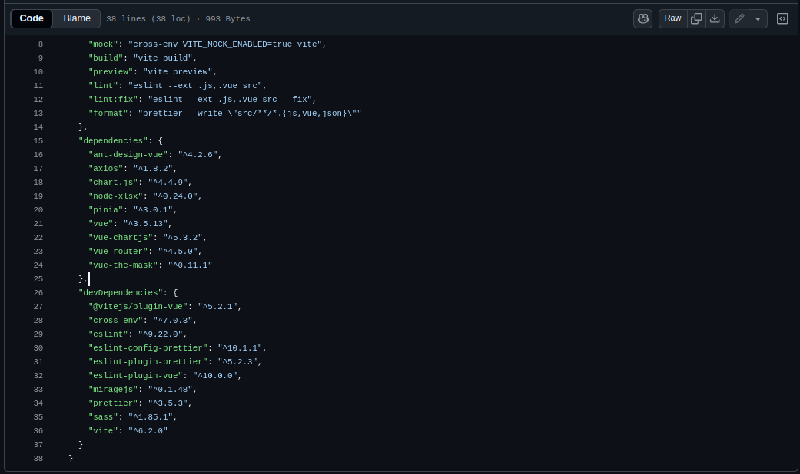
    

  

  

    
Definição de padrão de estilos para identidade visual

     
    Estabelecimento de um design system consistente para garantir uma identidade visual coesa e profissional ao projeto.
     
    

      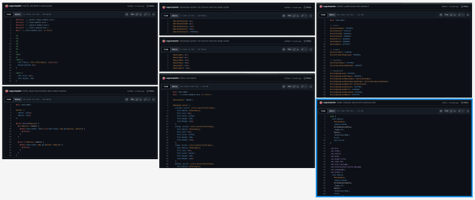
    

  

  

    
Dashboard

     
    Criação de uma interface visual interativa para exibir dados de forma clara e estratégica, auxiliando na tomada de decisões.
     
    

      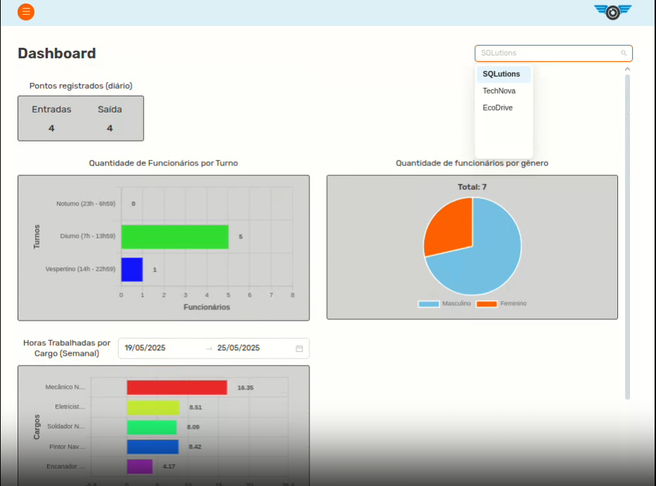
    

  

  

    
CRUD

     
    Implementação de operações CRUD (Create, Read, Update, Delete) para facilitar a gestão e manipulação de dados no sistema.
     
    

      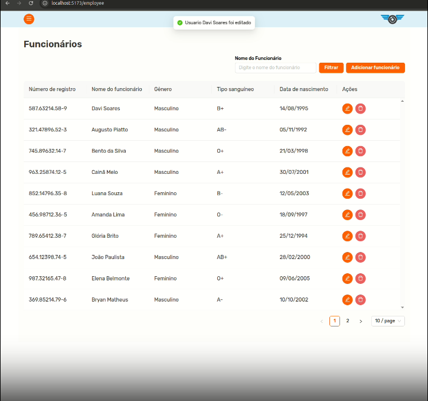
    

  

  
Desenvolvimento back-end utilizando SpringBoot

   
  Durante o desenvolvimento do projeto, atuei pontualmente realizando alguns bugs que surgiram, principalmente quando impactavam minhas tarefas no front-end, e atuei mais frequentemente nas últimas semanas, próximo à entrega. Foram pontos de correções:

   
  

    
Paginações

     
    Implementação de paginação para otimizar a exibição de grandes volumes de dados, garantindo melhor desempenho e usabilidade.
     
    

      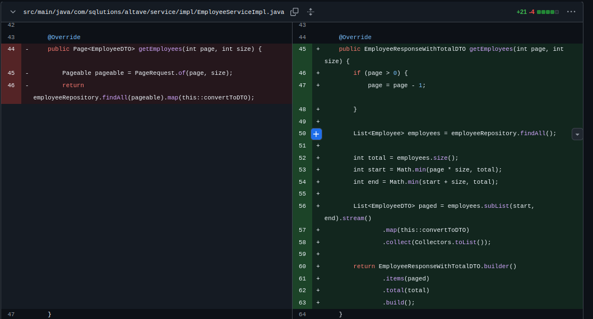
    

  

  

    
Endpoints de listagem

     
    Criação de endpoints de listagem para facilitar a recuperação e exibição de dados de forma eficiente e organizada.
     
    

      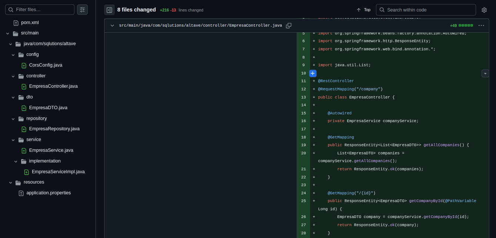
    

  

  

    
Estruturação de dados (DTO)

     
    Definição e implementação de DTOs (Data Transfer Objects) para organizar e otimizar a transferência de dados entre as camadas da aplicação.
     
    

      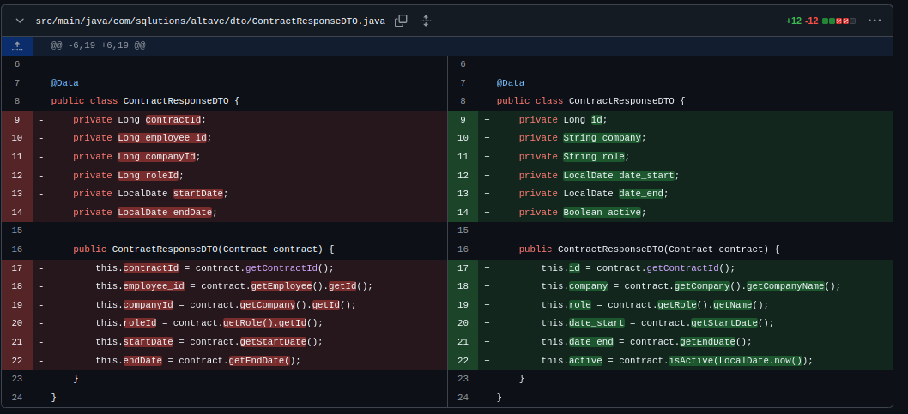
    

  

  

    
Ajustes de queries

     
    Otimização e correção de queries para melhorar o desempenho e garantir a precisão na manipulação e recuperação de dados.
     
    

      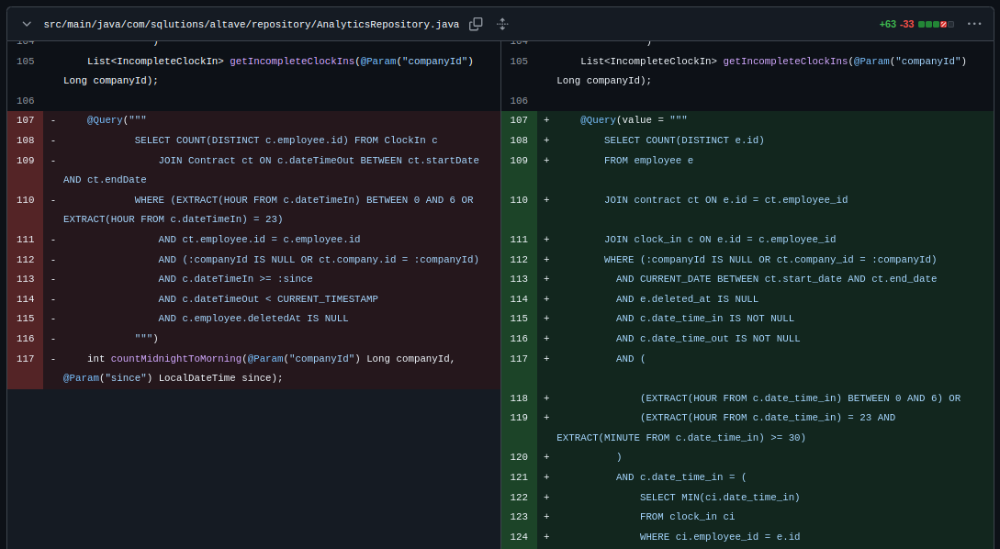
    

  

  

    
Padronização de código

     
    Estabelecimento de padrões de código para garantir consistência, legibilidade e manutenção eficiente do projeto.
     
    

      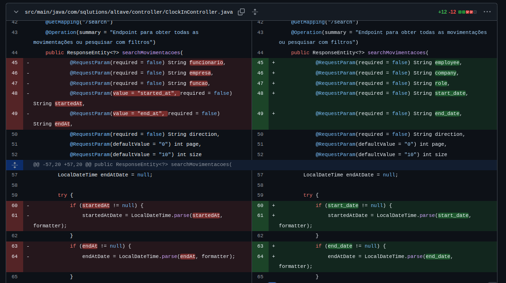
    

  

#### Hard Skills
* **Java e Orientação a Objetos**: Domínio intermediário em desenvolvimento Java, aplicando os princípios SOLID, e arquitetura limpa para criar soluções escaláveis e de fácil manutenção. Experiência no desenvolvimento de aplicações robustas utilizando coleções, streams, lambdas e tratamento de exceções, garantindo código eficiente e legível.
* **PostgreSQL**: Domínio intermediário em modelagem de bancos de dados relacionais, otimização de consultas SQL. Experiência em migração e administração de bancos PostgreSQL em ambientes de desenvolvimento e produção.
* **Vue**: Domínio avançado em arquitetura do projeto, criação de componentes para a divisão adequada de responsabilidades, compreensão de como é feita a comunicação entre sistemas via api.
* **CSS**: Domínio avançado em estilização de componentes visuais do projeto, com habilidade em implementar design systems consistentes, garantindo identidade visual coesa. Experiência em otimizar o desempenho de estilos, reduzindo redundâncias. Além disso, conhecimento em pré-processadores como SASS para modularização e reutilização de código.

#### Soft Skills
* **Trabalho em equipe**: Atuei com comunicação constante com o resto do time, principalmente com o meu par do back-end, devido ao meu foco no front-end. Em casos de discordância no time, expressei minha opinião e evitei o acúmulo de problemas. Trabalhei na integração das partes desenvolvidas por diferentes membros do time, garantindo que o sistema funcionasse de forma coesa.
* **Comunicação**: Participei ativamente de reuniões semanais com o time, garantindo alinhamento entre as entregas e as expectativas do cliente. Mantive uma comunicação clara e objetiva com o PO e o SM, detalhando minhas abordagens para as tarefas e antecipando possíveis desafios. Além disso, ofereci suporte aos membros com maior dificuldade no front-end, promovendo um ambiente colaborativo e reduzindo retrabalho por meio de alinhamentos frequentes.
* **Resolução de problemas**: Contribuí para o planejamento e estruturação inicial do banco de dados, propondo soluções práticas para desafios técnicos no back-end e garantindo a integração fluida com o front-end. No front-end, atuei na arquitetura geral, otimizando fluxos críticos e implementando melhorias que tornaram o sistema mais eficiente e escalável. Minha abordagem proativa ajudou a resolver gargalos técnicos e a manter o progresso do projeto dentro dos prazos estabelecidos.
