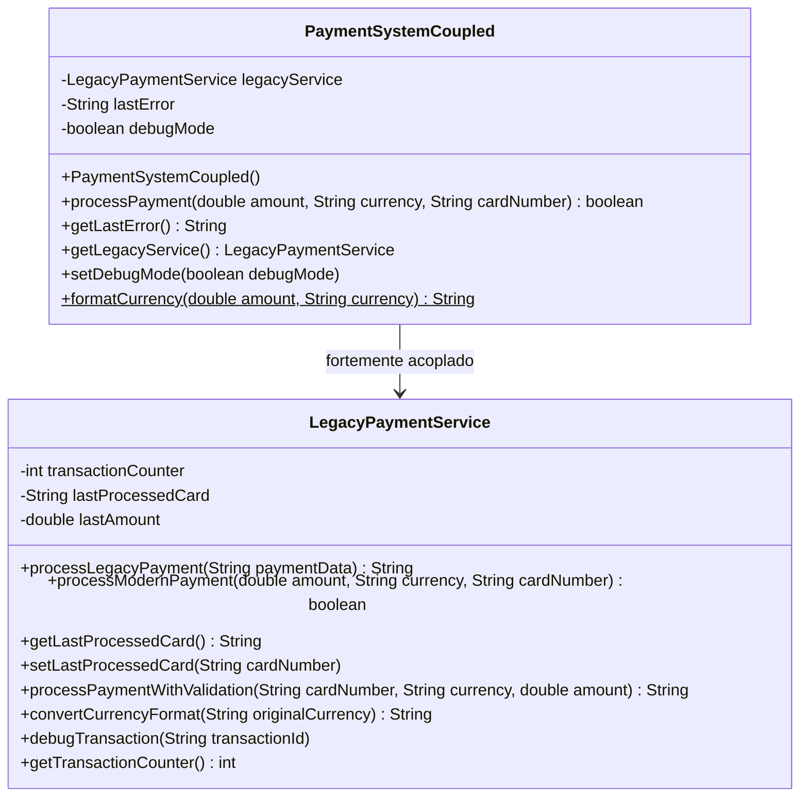

# Adapter Anti-Pattern

Este é um exemplo de como NÃO implementar o padrão Adapter. O anti-pattern demonstra os problemas de modificar diretamente o código legado, criar acoplamento forte entre classes e violar princípios fundamentais de design.

## Problemas do Anti-Pattern

### 1. **Acoplamento Forte**
- `PaymentSystemCoupled` cria diretamente a instância de `LegacyPaymentService`
- Impossível substituir a implementação sem modificar código
- Dificulta testes unitários

### 2. **Modificação Direta do Código Legado**
- `LegacyPaymentService` foi modificado com novos métodos
- Violação do princípio Aberto/Fechado (OCP)
- Risco de quebrar funcionalidades existentes
- Inconsistência entre métodos antigos e novos

### 3. **Violação do Princípio da Responsabilidade Única**
- `PaymentSystemCoupled` faz: validação, conversão, processamento, debug, formatação
- `LegacyPaymentService` mistura lógica original com adaptações

### 4. **Exposição de Detalhes Internos**
- Método `getLegacyService()` quebra encapsulamento
- Estado interno acessível via getters/setters
- Cliente pode modificar estado de forma inconsistente

### 5. **Lógica Hardcoded e Inflexível**
- Conversão de moedas com `if/else` hardcoded
- Impossível adicionar novas moedas sem modificar código
- Tratamento de erro inconsistente

### 6. **Dificuldade de Teste**
- Dependências criadas internamente
- Estado global compartilhado
- Múltiplos caminhos de execução na mesma classe

### 7. **Duplicação de Código**
- Lógica de conversão repetida em vários lugares
- Validações duplicadas
- Inconsistência entre implementações

## Consequências Negativas

- ❌ **Manutenibilidade baixa**: Mudanças afetam múltiplas classes
- ❌ **Testabilidade comprometida**: Difícil criar testes isolados
- ❌ **Flexibilidade reduzida**: Impossível trocar implementações
- ❌ **Risco alto**: Modificações podem quebrar código existente
- ❌ **Violação SOLID**: Múltiplos princípios violados
- ❌ **Código frágil**: Pequenas mudanças causam grandes impactos
- ❌ **Evolução limitada**: Difícil adicionar novos recursos

## Comparação com o Pattern Correto

| Aspecto | Anti-Pattern | Pattern Correto |
|---------|-------------|----------------|
| **Acoplamento** | Alto (dependência direta) | Baixo (interface) |
| **Modificação do legado** | Código original alterado | Código original preservado |
| **Responsabilidades** | Misturadas em uma classe | Separadas adequadamente |
| **Testabilidade** | Difícil (dependências hardcoded) | Fácil (injeção de dependência) |
| **Flexibilidade** | Baixa (código rígido) | Alta (substituição fácil) |
| **Manutenibilidade** | Baixa (mudanças arriscadas) | Alta (mudanças isoladas) |
