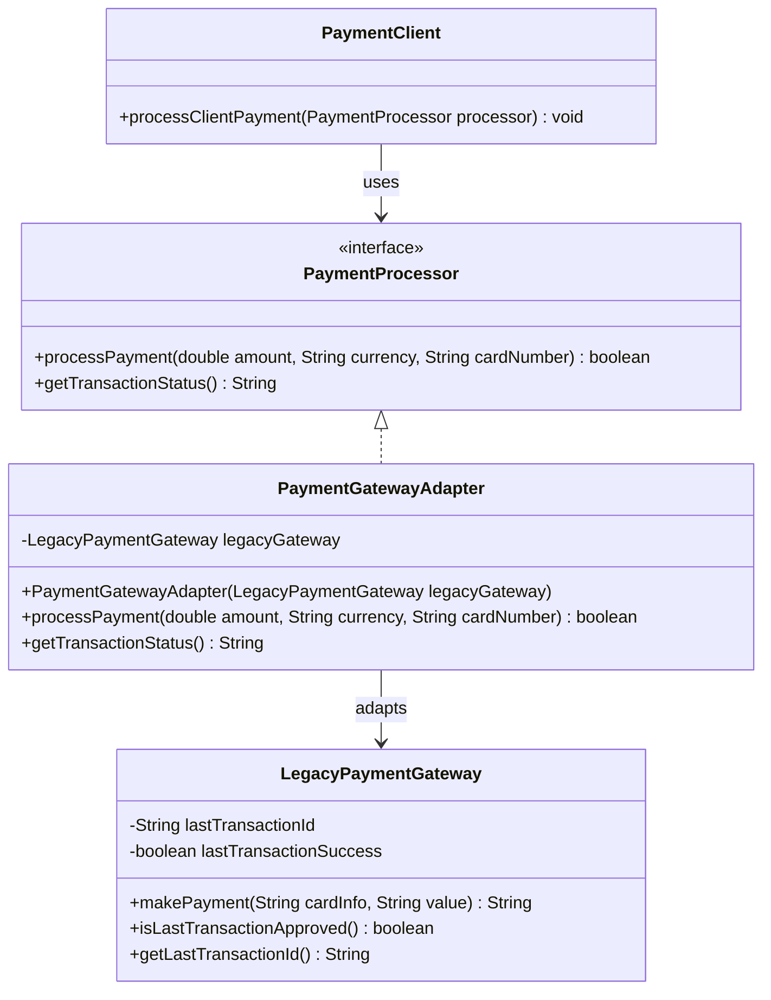

# Padrão Adapter - Exemplo de Boa Prática

Este é um exemplo de como implementar corretamente o padrão Adapter. O pattern permite que classes com interfaces incompatíveis trabalhem juntas através de uma classe adaptadora.



## Visão Geral

O padrão **Adapter** é um padrão estrutural que permite que classes com interfaces incompatíveis trabalhem juntas. Ele atua como um "tradutor" entre duas interfaces diferentes, permitindo que código existente seja reutilizado sem modificações.

## Problema Resolvido

Imagine que você tem um sistema que espera trabalhar com uma interface específica (`PaymentProcessor`), mas você precisa integrar um sistema legado (`LegacyPaymentGateway`) que tem uma interface completamente diferente. Sem o padrão Adapter, você teria que:

1. Modificar o sistema legado (nem sempre possível)
2. Modificar todo o código cliente (custoso e arriscado)
3. Duplicar funcionalidade (viola DRY)

## Solução com Adapter

O padrão Adapter resolve isso criando uma classe intermediária (`PaymentGatewayAdapter`) que:
- Implementa a interface esperada pelo cliente (`PaymentProcessor`)
- Internamente usa o sistema legado (`LegacyPaymentGateway`)
- Converte as chamadas entre as duas interfaces

## Estrutura do Exemplo

```
PaymentProcessor (Interface)
├── processPayment(double, String, String): boolean
└── getTransactionStatus(): String

LegacyPaymentGateway (Sistema Legado)
├── makePayment(String, String): String
├── isLastTransactionApproved(): boolean
└── getLastTransactionId(): String

PaymentGatewayAdapter (Adapter)
├── implements PaymentProcessor
├── wraps LegacyPaymentGateway
└── converte chamadas entre interfaces

AdapterPatternDemo (Demonstração)
└── mostra o uso prático do padrão
```

## Participantes

1. **Target (PaymentProcessor)**: Interface que o cliente espera usar
2. **Adaptee (LegacyPaymentGateway)**: Classe existente com interface incompatível
3. **Adapter (PaymentGatewayAdapter)**: Classe que adapta o Adaptee ao Target
4. **Client (PaymentClient)**: Código que usa o Target

## Benefícios do Pattern

- ✅ **Reutilização de código**: Permite usar sistemas legados sem modificá-los
- ✅ **Separação de responsabilidades**: A lógica de conversão fica isolada no Adapter
- ✅ **Princípio Aberto/Fechado**: Código fechado para modificação, aberto para extensão
- ✅ **Flexibilidade**: Permite integrar múltiplos sistemas com interfaces diferentes
- ✅ **Manutenibilidade**: Mudanças na interface legada só afetam o Adapter
- ✅ **Interface unificada**: Cliente trabalha sempre com a mesma interface
- ✅ **Desacoplamento**: Sistema cliente não conhece detalhes do sistema legado

## Quando Usar

- Integração com sistemas legados
- Uso de bibliotecas de terceiros com interfaces incompatíveis
- Migração gradual de sistemas antigos
- Integração de diferentes APIs externas

## Como Executar

```bash
# Compilar os arquivos
javac *.java

# Executar a demonstração
java AdapterPatternDemo
```

## Saída Esperada

```
=== DEMONSTRAÇÃO DO PADRÃO ADAPTER ===

1. Tentativa de usar o sistema legado diretamente:
   (Isso não funcionaria porque as interfaces são incompatíveis)

2. Usando o Adapter para integrar o sistema legado:
Cliente: Iniciando processamento de pagamento...
Cliente: Valor: $150.75 USD
Cliente: Cartão: 4532-1234-5678-9012

Adapter: Convertendo chamada para o sistema legado...
Sistema Legado: Processando pagamento...
Cartão: 4532-1234-5678-9012|USD
Valor: 150.75
Sistema Legado: Pagamento aprovado - ID: LEG_1697299200000
Adapter: Conversão concluída. Resultado: Sucesso

Cliente: Resultado do pagamento: SUCESSO
Cliente: Status: APPROVED - Transaction ID: LEG_1697299200000
```

## Diferença do Anti-Pattern

Ao contrário do anti-pattern (que geralmente envolve modificação direta do código legado ou código cliente), este exemplo:

1. **Preserva o código existente**: Não modifica `LegacyPaymentGateway`
2. **Mantém a interface padrão**: `PaymentProcessor` permanece inalterada
3. **Isola a complexidade**: Toda lógica de conversão fica no Adapter
4. **Facilita testes**: Cada componente pode ser testado independentemente
5. **Permite extensibilidade**: Novos adapters podem ser criados facilmente

## Padrões Relacionados

- **Facade**: Simplifica interface complexa (vs Adapter que compatibiliza interfaces)
- **Decorator**: Adiciona comportamento (vs Adapter que converte interface)
- **Proxy**: Controla acesso (vs Adapter que adapta interface)
