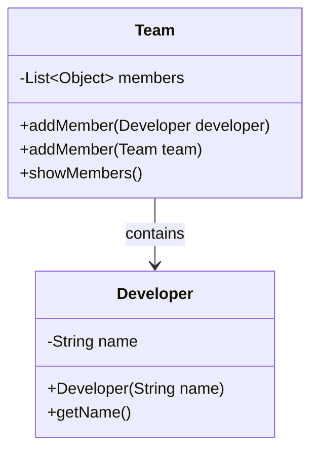

# Composite Anti-Pattern

Este é um exemplo de como NÃO implementar o padrão Composite. O anti-pattern demonstra os problemas de não usar uma interface comum e ter métodos específicos para cada tipo.

## Problemas do Anti-Pattern
1. Métodos duplicados `addMember` para cada tipo
2. Uso de casting com `instanceof`
3. Lista de `Object` ao invés de uma interface comum
4. Difícil extensibilidade para novos tipos de membros
5. Violação do princípio Open/Closed
