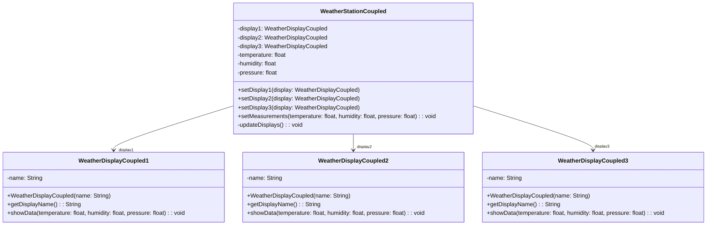

# Observer Anti-Pattern

Este é um exemplo de como NÃO implementar o padrão Observer. O anti-pattern demonstra os problemas do acoplamento forte entre o subject (WeatherStation) e seus observers (displays).

## Problemas do Anti-Pattern

1. **Acoplamento Forte**
   - WeatherStation conhece especificamente cada tipo de display
   - Referências diretas aos displays são mantidas como atributos

2. **Inflexibilidade**
   - Número fixo de displays (apenas phone, web e tv)
   - Para adicionar novo tipo de display, precisa modificar a classe WeatherStation

3. **Violação do Open/Closed Principle**
   - Adicionar ou remover tipos de displays requer alteração no código existente
   - Estrutura não é extensível sem modificação

4. **Controle Manual de Observers**
   - Remoção de displays através de comparação manual de nomes
   - Gerenciamento complexo de referências null

5. **Dificuldade de Manutenção**
   - Mudanças no protocolo de comunicação afetam todas as classes
   - Cada novo display requer alterações em múltiplos métodos
