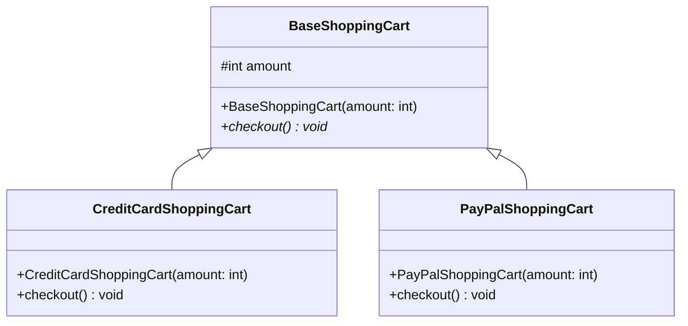

# Strategy Anti-Pattern

Este é um exemplo de como NÃO implementar o padrão Strategy. O anti-pattern demonstra os problemas de usar herança ao invés de composição para implementar diferentes estratégias.

## Problemas do Anti-Pattern

1. **Herança vs Composição**
   - Usa herança ao invés de composição, criando um acoplamento forte
   - Cada nova estratégia de pagamento requer uma nova classe

2. **Violação do Open/Closed Principle**
   - Para adicionar um novo método de pagamento (ex: PIX), é necessário criar uma nova classe que herda de BaseShoppingCart
   - A estrutura não é facilmente extensível

3. **Inflexibilidade**
   - Não é possível trocar a estratégia de pagamento em tempo de execução
   - O tipo de pagamento é definido na criação do objeto

4. **Duplicação de Código**
   - Lógica similar é repetida em cada subclasse
   - Mudanças na lógica de pagamento requerem alterações em múltiplas classes

5. **Explosão de Classes**
   - Cada nova forma de pagamento resulta em uma nova classe
   - A hierarquia de classes cresce desnecessariamente
