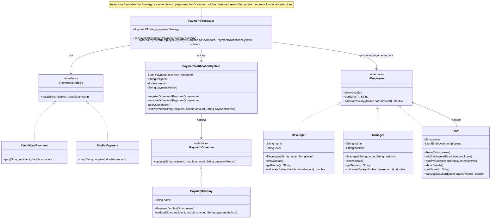
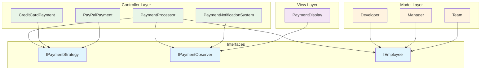
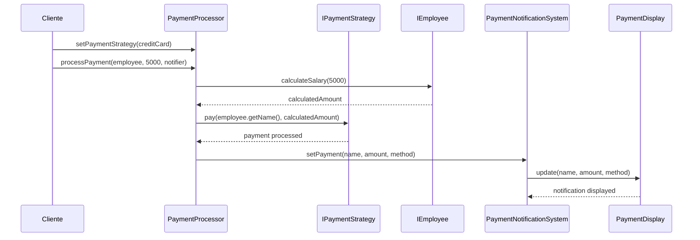

# Padrões Strategy + Observer + Composite

Este exemplo demonstra como três padrões de design podem trabalhar juntos harmoniosamente em um sistema de processamento de pagamentos para funcionários organizados em equipes.

## Visão Geral dos Padrões

### 1. Strategy Pattern (Estratégia de Pagamento)
Permite alternar entre diferentes métodos de pagamento sem modificar o código cliente.

### 2. Observer Pattern (Sistema de Notificações)
Permite que múltiplos observadores sejam notificados quando um pagamento é processado.

### 3. Composite Pattern (Estrutura de Funcionários)
Permite tratar funcionários individuais e equipes de forma uniforme através de uma interface comum.

## Diagrama UML Completo



## Arquitetura por Camadas



## Fluxo de Execução



## Estrutura de Diretórios

```
strategy_observer_composite/
├── controller/
│   ├── IPaymentStrategy.java          # Interface Strategy
│   ├── CreditCardPayment.java         # Concrete Strategy 1
│   ├── PayPalPayment.java            # Concrete Strategy 2
│   ├── PaymentProcessor.java          # Context (Strategy)
│   ├── IPaymentObserver.java         # Observer Interface
│   └── PaymentNotificationSystem.java # Subject (Observer)
├── model/
│   ├── IEmployee.java                 # Component (Composite)
│   ├── Developer.java                 # Leaf (Composite)
│   ├── Manager.java                   # Leaf (Composite)
│   └── Team.java                      # Composite (Composite)
├── view/
│   └── PaymentDisplay.java            # Concrete Observer
└── StrategyObserverCompositeDemo.java # Demonstration
```

## Benefícios da Integração

### ✅ **Flexibilidade Máxima**
- **Strategy**: Troca algoritmos de pagamento dinamicamente
- **Observer**: Adiciona/remove notificadores sem modificar código
- **Composite**: Trata indivíduos e grupos uniformemente

### ✅ **Baixo Acoplamento**
- Cada padrão opera independentemente
- Interfaces bem definidas entre componentes
- Fácil manutenção e evolução

### ✅ **Alta Coesão**
- Responsabilidades bem separadas
- Cada classe tem um propósito específico
- Código organizado e legível

### ✅ **Extensibilidade**
- Novos métodos de pagamento (Strategy)
- Novos tipos de notificação (Observer)
- Novos tipos de funcionário (Composite)

## Casos de Uso

1. **Pagamento Individual**: Developer ou Manager recebe salário via método escolhido
2. **Pagamento de Equipe**: Team inteira recebe pagamento calculado recursivamente
3. **Múltiplas Notificações**: Diferentes sistemas são notificados simultaneamente
4. **Troca de Método**: Alternar entre CartãoCredito e PayPal dinamicamente

## Padrões em Ação

### Strategy Pattern
```java
processor.setPaymentStrategy(new CreditCardPayment());
processor.processPayment(employee, 5000, notifier);
```

### Observer Pattern
```java
notifier.registerObserver(new PaymentDisplay("Sistema Principal"));
notifier.registerObserver(new PaymentDisplay("Auditoria"));
```

### Composite Pattern
```java
Team team = new Team("Desenvolvimento");
team.addEmployee(new Developer("João", "Senior"));
team.addEmployee(new Manager("Maria", "Tech Lead"));
double totalSalary = team.calculateSalary(5000); // Calcula para todos
```

## Como Executar

```bash
# Compilar todos os arquivos
javac **/*.java

# Executar a demonstração
java StrategyObserverCompositeDemo
```

## Saída Esperada

```
=== DEMONSTRAÇÃO DOS PADRÕES INTEGRADOS ===

Configurando equipe de desenvolvimento...
Team: Desenvolvimento
Developer: João Silva (Senior)
Manager: Maria Santos (Tech Lead)

Processando pagamentos com CartãoCredito:
💳 Pagamento de R$ 7500.0 para João Silva via Cartão de Crédito
🔔 Sistema Principal: Pagamento processado - João Silva recebeu R$ 7500.0 via CreditCardPayment
🔔 Auditoria: Pagamento processado - João Silva recebeu R$ 7500.0 via CreditCardPayment

💳 Pagamento de R$ 10000.0 para Maria Santos via Cartão de Crédito
🔔 Sistema Principal: Pagamento processado - Maria Santos recebeu R$ 10000.0 via CreditCardPayment
🔔 Auditoria: Pagamento processado - Maria Santos recebeu R$ 10000.0 via CreditCardPayment

Trocando para PayPal:
📧 Pagamento de R$ 17500.0 para Desenvolvimento via PayPal
🔔 Sistema Principal: Pagamento processado - Desenvolvimento recebeu R$ 17500.0 via PayPalPayment
🔔 Auditoria: Pagamento processado - Desenvolvimento recebeu R$ 17500.0 via PayPalPayment
```

## Vantagens desta Abordagem

- **Código Limpo**: Separação clara de responsabilidades
- **Facilidade de Teste**: Cada componente pode ser testado isoladamente
- **Manutenibilidade**: Mudanças são localizadas e controladas
- **Reutilização**: Componentes podem ser reutilizados em outros contextos
- **Escalabilidade**: Sistema cresce de forma organizada

Esta implementação demonstra como padrões de design diferentes podem trabalhar juntos para criar uma solução robusta, flexível e maintível.